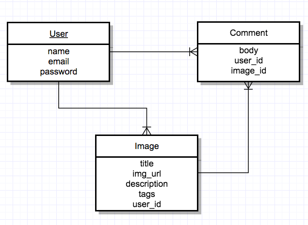
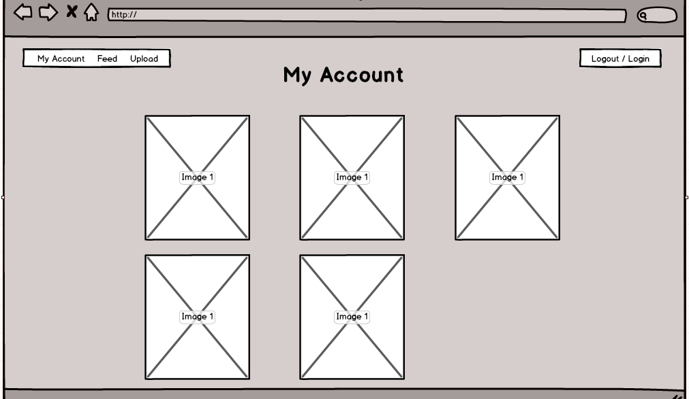
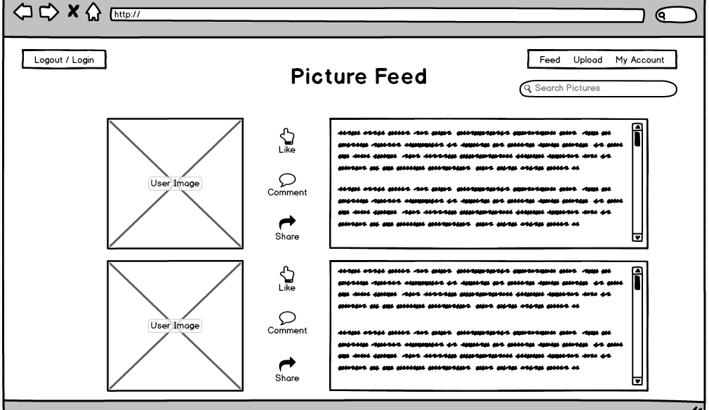

##

# _Project 2 - WDI_

<https://ancient-sands-36504.herokuapp.com/>

# What it is?
A full stack website that allows users to upload images to the cloud where they can be viewed, liked (by other users), and commented on... a.k.a. Instagram

# Technologies used:
- Ruby
- Ruby on Rails
- HTML, CSS
- PostgreSQL
- Bootstrap
- Paperclip (gem)
- Amazon S3 (gem) 
- Masonry (gem)
- Act_as_votable (gem)
- Simple_form (gem)
- Heroku (web host)

#ERD
##

#Mock-ups
##
##
##

# Major Functionality:
- Account/User profile creation
- Authentication 
- Image CRUD abilities
- Comment CRUD abilities
- Ability to like(upvote) an image
- Ability to comment on an image

# Functionality left to add:
- Ability to share a photo
- Create an admin account that can delete and edit users
- Ability to reset your password if you forgot it
- Ability to see who liked each photo
- Ability to tag another user in a comment
- Ability to click on a tag of an image and see other images with those same tags

#For the future
- Incorporate either Google's Vision API or IBM Watson's Visual Recognition API to analyze images and either generate tags or edit the image, etc.

